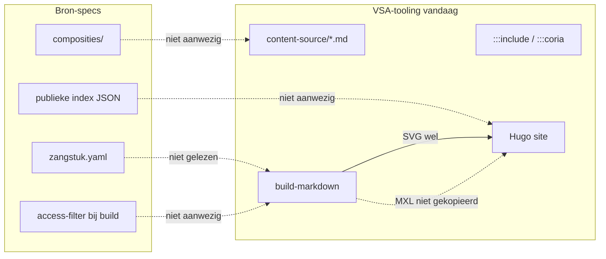
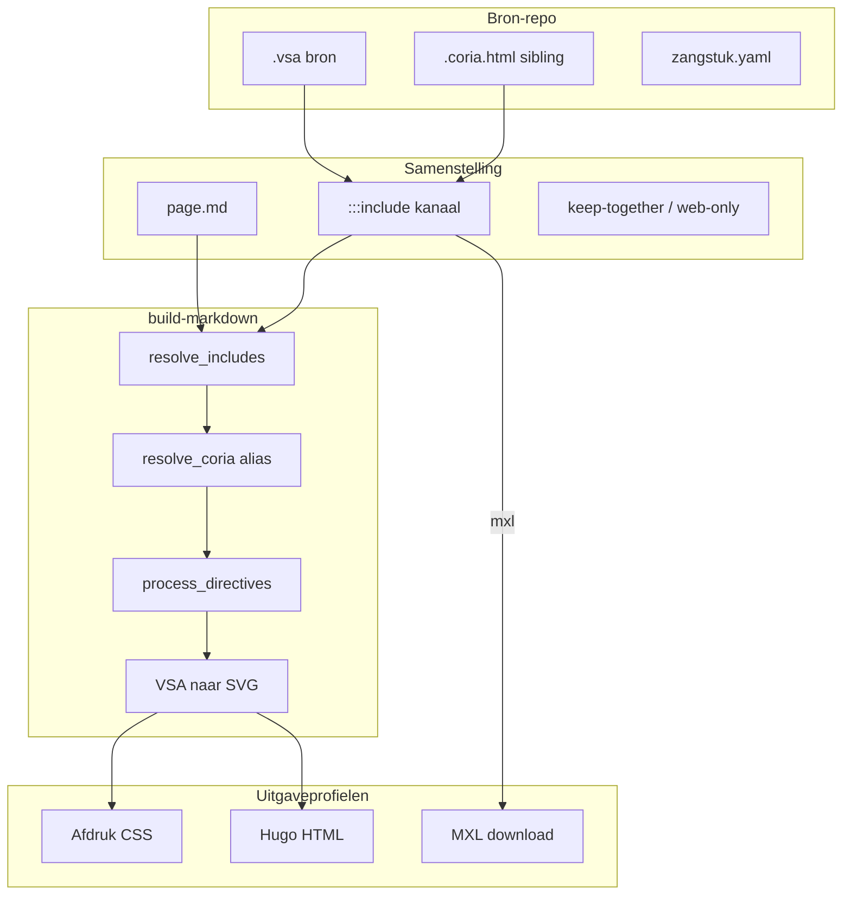

# Plan: Samenstelling, uitgaveprofielen en kanaal-includes

Status: ontwerp / implementatieplan (juni 2026).

Eerste increment: spec-sectie over concepten/kanalen + `:::include svg|coria|mxl` als
kanaal-alias op bestaande resolver + één demo-pagina in hugo-demo.

---

## Review van het voorgestelde plan

Het plan is coherent en in de juiste volgorde: eerst terminologie en architectuur vastleggen, dan een klein code-increment dat de bestaande pipeline uitbreidt zonder nesting of bron-repo-integratie te forceren. Dat past bij de huidige stand:

- [spec-vsa-document-samenstellen.md](spec-vsa-document-samenstellen.md) beschrijft al **één HTML-pipeline** met print-CSS (uitgaveprofiel Afdruk ≈ Online + `@media print`).
- [../src/vsa/content_assets.py](../src/vsa/content_assets.py) heeft al `resolve_asset` voor `coria` en `mxl`; `:::coria` werkt via [../src/vsa/markdown_coria.py](../src/vsa/markdown_coria.py).
- [todo.md](todo.md) §2.2 (gegeneraliseerde include) en §2.3 (nesting) zijn de logische vervolgstappen onder deze paraplu.
- Bron-specs (zip) beschrijven **zangstukken + composities**; VSA-tooling beschrijft **Markdown-samenstelling + build**. Die lagen zijn complementair, nog niet verbonden.

**Housekeeping (gevraagd):** markeer [todo.md](todo.md) §1.3 als `Afgerond` — halftoon-prefixen zijn geïmplementeerd en getest ([../tests/test_halftoon_prefix.py](../tests/test_halftoon_prefix.py), validatie in [../src/vsa/validation_runner.py](../src/vsa/validation_runner.py)).

---

## Bron-specs: kern en lacunes t.o.v. VSA-tooling

Geanalyseerd: `samenvatting-project.md` en `bron-repo-specificatie.md` uit `bron-specs.zip`.

### Wat bron-specs definieert

| Concept            | Definitie in bron-spec                                             |
| ------------------ | ------------------------------------------------------------------ |
| **Zangstuk**       | Eenheid met `zangstuk.yaml` + `sources/` onder `zangstukken/<id>/` |
| **Bron**           | Bestand zonder geautomatiseerd generatiepad (VSA, scan, MusicXML)  |
| **Afgeleid**       | SVG/MXL uit VSA — **niet** in git, build-time genereren            |
| **Compositie**     | YAML-lijst zangstukken in volgorde (§7, nog open)                  |
| **Source-variant** | Entry in `sources:` met `file:` / `access:` / `status:`            |

### Lacunes (gap-analyse)



| Bron-spec verwachting              | VSA-tooling status                                                              | Gap / actie                                                           |
| ---------------------------------- | ------------------------------------------------------------------------------- | --------------------------------------------------------------------- |
| Per-zangstuk map + `zangstuk.yaml` | Demo: platte map `praktijk/zondagen/` met losse `.vsa`                          | **Conventie-documentatie**; geen code in increment 1                  |
| Afgeleide SVG niet in git          | SVG gegenereerd bij `build-markdown`                                            | **Aligned**                                                           |
| Afgeleide MXL niet in git          | URL berekend in `resolve_asset`, maar **niet** gekopieerd/gegenereerd bij build | Later: MXL-build-stap of CI-koppeling                                 |
| `.coria.html` sibling              | Ondersteund + gekopieerd naar `static/coria/`                                   | **Aligned**; niet genoemd in bron-spec — toevoegen in architectuurdoc |
| Compositie-laag (YAML)             | Geen equivalent; samenstelling = handmatige `.md`                               | **Terminologisch onderscheid** (zie hieronder)                        |
| Publieke index + copyright-filter  | Niet aanwezig                                                                   | Later (§8 bron-spec)                                                  |
| VSA-frontmatter vs `zangstuk.yaml` | Frontmatter geparset voor alt/scale; geen cross-validatie                       | Later validatiestap                                                   |
| Cross-zangstuk scan-referenties    | `:::include` relatief pad werkt                                                 | **Aligned** op pad-niveau; geen `zangstuk-id`-resolver                |

**Conclusie:** het eerste increment hoeft geen bron-repo-parser te bouwen. Wel: terminologie en pad-conventies vastleggen zodat latere integratie (compositie → markdown, `zangstuk-id`-includes) voorbereid is.

---

## Terminologie-voorstel

Vervang werknaam “samengestelde uitgaven” door **samenstelling** (het auteursartefact) en **uitgave** (het resultaat voor lezers).

| Term               | Definitie                                                                                                   | Voorbeeld                                         |
| ------------------ | ----------------------------------------------------------------------------------------------------------- | ------------------------------------------------- |
| **Bron**           | Authoritative bestand dat niet uit een ander repo-bestand gegenereerd wordt                                 | `sources/vsa/groningen.vsa`, scan-PDF             |
| **Zangstuk**       | Canonieke eenheid in bron-repo (`zangstuk.yaml` + sources)                                                  | `troparion-zondag-toon-1`                         |
| **Samenstelling**  | Markdown-document (eventueel met includes) dat bronfragmenten ordent voor een doel                          | `zondag-toon-3.md`, koormap-pagina                |
| **Compositie**     | *Alleen bron-repo-term*: YAML-lijst zangstuk-referenties in volgorde — **niet** hetzelfde als samenstelling | `composities/antifonen-weekdagen.yaml` (toekomst) |
| **Uitgaveprofiel** | Doelgroep/medium waarvoor de build bedoeld is                                                               | Afdruk, Online, Bewerking                         |
| **Kanaal**         | Exportmechanisme vanuit één `.vsa`-bron naar een afgeleide representatie                                    | `svg`, `coria`, `mxl`                             |

### Uitgaveprofielen (v1)

| Profiel               | Doel                          | Mechanismen in VSA-tooling                                                  |
| --------------------- | ----------------------------- | --------------------------------------------------------------------------- |
| **Afdruk / download** | Koormap, liturgisch boekje    | `@media print`, `keep-together`, `pagebreak`, `print-only`, SVG-schaal      |
| **Online**            | Responsive website + oefenen  | Hugo, `web-only`, `<details>`/tabs (toekomst), Coria/MP3 via `coria`-kanaal |
| **Bewerking**         | Verder uitwerken in MuseScore | `mxl`-kanaal → download/URL naar MusicXML                                   |

Profielen zijn **niet** aparte pipelines: één HTML-samenstelling, conditionele directives en kanalen bepalen wat zichtbaar/downloadbaar is.

---

## Architectuurdoc

**Aanpak:** uitbreiden van [spec-vsa-document-samenstellen.md](spec-vsa-document-samenstellen.md) (niet hernoemen in increment 1 — titel kan later naar *VSA Samenstelling en Uitgave* als de scope breder wordt).

### Nieuwe secties (eerste deliverable — spec-deel)

1. **Concepten en terminologie** — tabel hierboven + relatie bron-repo ↔ content-source
2. **Uitgaveprofielen** — drie profielen, mapping naar directives/CSS
3. **Kanalen** — syntax `:::include <kanaal> "bron.vsa" …:::`, sibling-conventie (`melodie.vsa` + optioneel `melodie.coria.html`)
4. **Relatie bron-repo** — mapping:

   | Bron-repo                            | Samenstelling (VSA-tooling)                                 |
   | ------------------------------------ | ----------------------------------------------------------- |
   | `zangstukken/<id>/sources/vsa/*.vsa` | `:::include svg "…vsa"` of platte `.vsa` in content-source  |
   | `zangstuk.yaml` metadata             | Frontmatter / pagina-titel (handmatig tot resolver bestaat) |
   | `composities/*.yaml`                 | Toekomst: generator naar `.md` of include-index             |

5. **Nesting-regels en authoring-conventies** — besluit hieronder

### Nesting: besluit voor v1

**Aanbevolen besluit (increment 1):**

| Regel                                                                       | Status                                                                                                                                           |
| --------------------------------------------------------------------------- | ------------------------------------------------------------------------------------------------------------------------------------------------ |
| Blok-directives (`web-only`, `print-only`, `keep-together`) **niet nesten** | Behouden — implementatie in [../src/vsa/markdown_directives.py](../src/vsa/markdown_directives.py) blijft                                              |
| Regel-directives (`:::include`, `:::coria`) **binnen** `keep-together`      | Toegestaan — verwerkt in eerdere passes vóór `process_directives`                                                                                |
| Authoring-conventie voor titels/navigatie                                   | `web-only` als **sibling vóór** `keep-together` (zoals [../examples/hugo-demo/content-source/praktijk/zondagen/zondag-toon-3.md](../examples/hugo-demo/content-source/praktijk/zondagen/zondag-toon-3.md)) |
| Coria-link alleen online, notatie samen printen                             | Coria-regels binnen `keep-together`; print verbergt `.coria-play` via CSS (bestaand patroon)                                                     |

**Fase 2 (§2.3 todo):** nesting `web-only` ⊂ `keep-together` alleen als sibling-conventie onwerkbaar blijkt — vereist wijziging state machine, niet nodig voor eerste demo.

---

## Eerste deliverable (concreet)

Drie onderdelen in één PR-achtige eenheid:

### 1. Spec-sectie (~100 regels)

Toevoegen aan [spec-vsa-document-samenstellen.md](spec-vsa-document-samenstellen.md):

- Concepten, profielen, kanalen, bron-repo-mapping, nesting-besluit
- Bijwerken §3 Transclusion: kanaal-syntax naast extensie-syntax
- [todo.md](todo.md): §1.3 → `Afgerond`; §2.2 → gedeeltelijk (`svg`/`coria`/`mxl` alias; volledige bron-repo-default nog open)

### 2. Minimale code

**Bestand:** [../src/vsa/markdown_include.py](../src/vsa/markdown_include.py)

Uitbreiden regex en dispatch:

```markdown
:::include svg "melodie.vsa" alt="…" scale="85%":::
:::include coria "melodie.vsa" label="Oefenen in Coria" mode="auto":::
:::include mxl "melodie.vsa" label="Download MusicXML":::
```

Gedrag:

| Kanaal                         | Pad       | Output                                                                                                                              |
| ------------------------------ | --------- | ----------------------------------------------------------------------------------------------------------------------------------- |
| *(geen)* + `.vsa`              | bestaand  | `::: vsa-notatie` wrapper (ongewijzigd)                                                                                             |
| `svg` + `.vsa`                 | expliciet | Zelfde als `.vsa`-include (alias voor auteur-clarity)                                                                               |
| `coria` + `.vsa`               | expliciet | Hugo `coria-html` / `coria` shortcode via `resolve_asset`                                                                           |
| `mxl` + `.vsa`                 | expliciet | Download-link naar `{mxl_url_prefix}/…/melodie.mxl` (eenvoudige `<a class="mxl-download">` of gedeelde helper uit `markdown_coria`) |
| *(geen)* + `.md`/`.svg`/raster | bestaand  | Ongewijzigd                                                                                                                         |

Implementatiedetails:

- `content_root` doorgeven aan `resolve_includes` (nu al optioneel; verplicht maken wanneer kanaal `coria`/`mxl`)
- Hergebruik `resolve_asset` uit [../src/vsa/content_assets.py](../src/vsa/content_assets.py); **geen** `svg`-kanaal in `resolve_asset` nodig
- `:::coria` blijft werken; intern kan het dezelfde helper aanroepen
- Backward compatible: `:::include melodie.vsa` zonder kanaal blijft geldig

**Tests:** [../tests/test_markdown_include.py](../tests/test_markdown_include.py) — minimaal:

- `include svg` ≡ `include melodie.vsa`
- `include coria` met `.coria.html` sibling → `coria-html` shortcode
- `include coria` zonder sibling → `coria` shortcode (MXL URL)
- `include mxl` → download-URL
- onbekend kanaal → `IncludeError`
- kanaal + `.md` → fout (kanaal alleen voor `.vsa`)

### 3. Demo-pagina

Nieuw bestand: [../examples/hugo-demo/content-source/praktijk/zondagen/kanalen-demo.md](../examples/hugo-demo/content-source/praktijk/zondagen/kanalen-demo.md)

Gebruikt bestaande assets van toon 3 (`tropaar-zondag-toon-3.vsa` + `tropaar-zondag-toon-3.coria.html`):

```markdown
---
title: "Demo: include-kanalen"
---

:::web-only:::
# Include-kanalen (svg · coria · mxl)

Demonstratie van `:::include svg|coria|mxl` op één zangstuk.
:::end-web-only:::

:::keep-together scale="100%":::
## SVG (afdruk + online)

:::include svg "tropaar-zondag-toon-3.vsa" alt="Tropaar toon 3" scale="85%":::

## Coria (online oefenen)

:::include coria "tropaar-zondag-toon-3.vsa" label="Oefenen in Coria":::

## MXL (bewerking)

:::include mxl "tropaar-zondag-toon-3.vsa" label="Download MusicXML":::
:::end-keep-together:::
```

Optioneel: link vanuit [../examples/hugo-demo/content-source/praktijk/zondagen/](../examples/hugo-demo/content-source/praktijk/zondagen/) overzichtspagina.

---

## Wat bewust buiten increment 1 blijft

- Geneste blok-directives (§2.3) — alleen gedocumenteerd, niet geïmplementeerd
- Bron-repo `zangstuk.yaml`-resolver / compositie-generator
- MXL genereren/kopiëren bij build (MXL-link kan 404 geven tot CI `vsa musicxml` draait — vermelden in demo)
- Hernoemen spec-bestand, publieke JSON-index, copyright-filter
- `<details>`/tabs voor online-profiel

---

## Architectuur-overzicht (doelbeeld)


