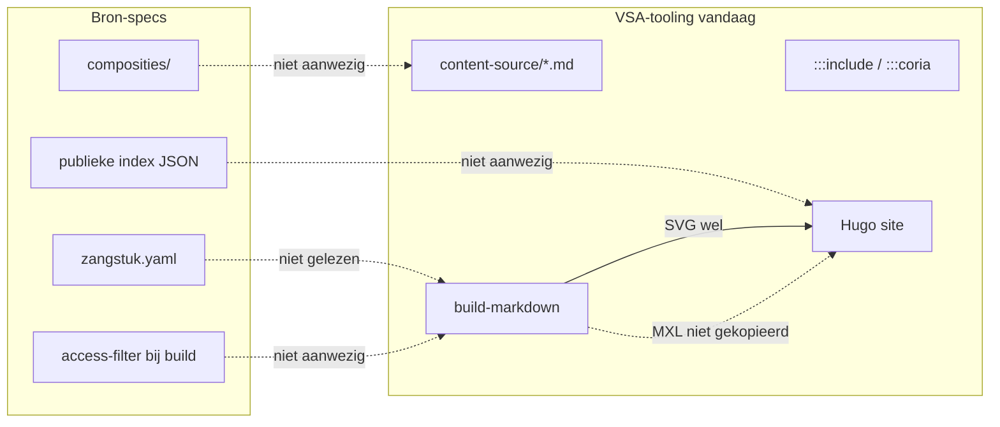
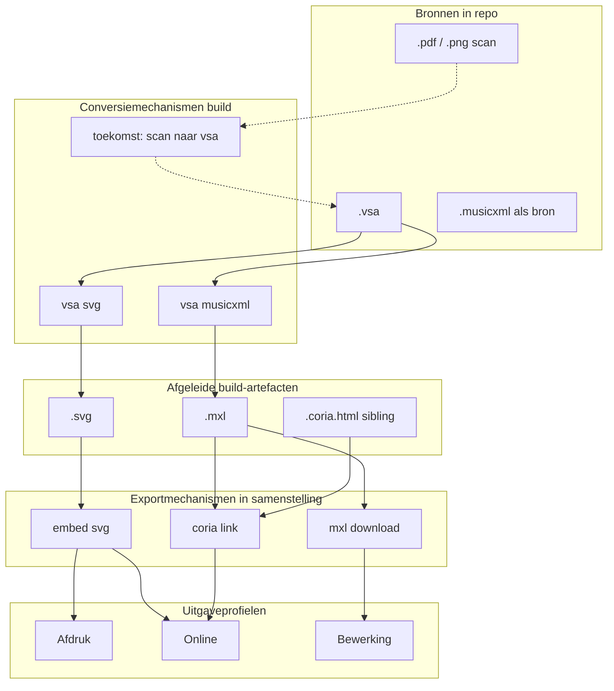
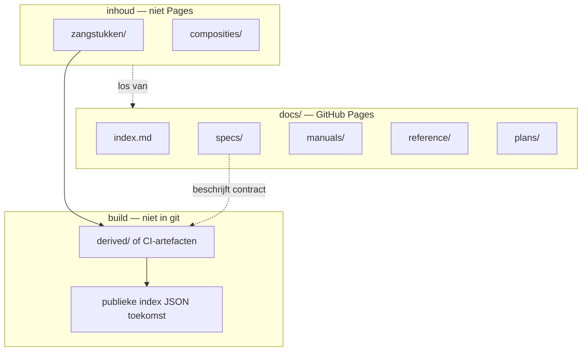
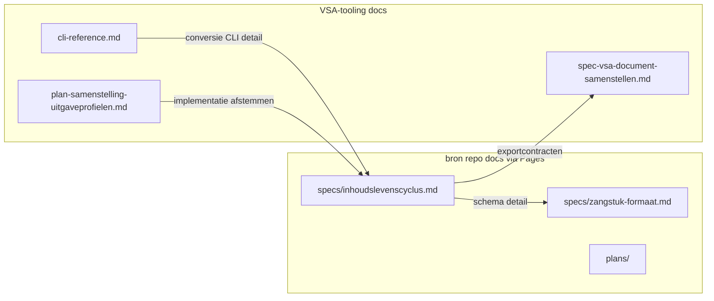
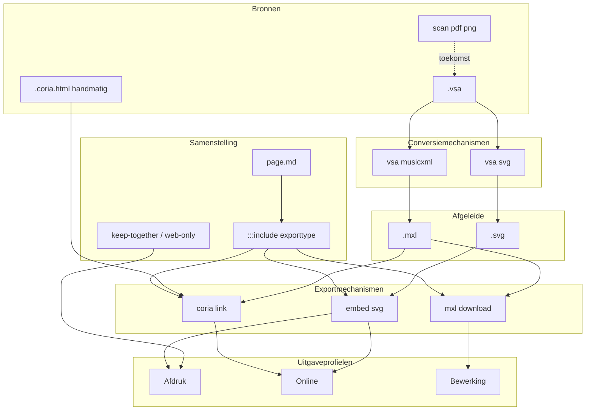

# Plan: Samenstelling, uitgaveprofielen en export-includes

Status: **Spoor B geïmplementeerd** (juni 2026): `:::include svg|coria|mxl` + demo-pagina; expliciete conversiestap in CI nog open.

Normatieve contracten:
[bron — exportcontracten](https://orthodox-groningen.github.io/bron/reference/exportcontracten/),
[conversiemechanismen](https://orthodox-groningen.github.io/bron/reference/conversiemechanismen/),
[CI-architectuur](https://orthodox-groningen.github.io/bron/plans/ci-architectuur/).

Gebruikseisen per drager (papier/tablet/telefoon):
[gebruikseisen-dragers.md](gebruikseisen-dragers.md).

Eerste increment: spec-sectie over concepten (conversie vs. export) +
`:::include svg|coria|mxl` als **exporttype** in de samenstelling + één demo-pagina
in VSA-demo.

---

## Review van het voorgestelde plan

Het plan is coherent en in de juiste volgorde: eerst terminologie en architectuur vastleggen, dan een klein code-increment dat de bestaande pipeline uitbreidt zonder nesting of bron-repo-integratie te forceren. Dat past bij de huidige stand:

- [spec-vsa-document-samenstellen.md](spec-vsa-document-samenstellen.md) beschrijft al **één HTML-pipeline** met print-CSS (uitgaveprofiel Afdruk ≈ Online + `@media print`).
- [../src/vsa/content_assets.py](../src/vsa/content_assets.py) resolveert export-URL's naar afgeleide (`coria`, `mxl`); `:::coria` werkt via [../src/vsa/markdown_coria.py](../src/vsa/markdown_coria.py).
- [todo.md](todo.md) §2.2 (gegeneraliseerde include met exporttypes) en §2.3 (nesting) zijn de logische vervolgstappen onder deze paraplu.
- Bron-specs (zip) beschrijven **zangstukken + composities**; VSA-tooling beschrijft **Markdown-samenstelling + build**. Die lagen zijn complementair, nog niet verbonden.

**Housekeeping (gevraagd):** markeer [todo.md](todo.md) §1.3 als `Afgerond` — halftoon-prefixen zijn geïmplementeerd en getest ([../tests/test_halftoon_prefix.py](../tests/test_halftoon_prefix.py), validatie in [../src/vsa/validation_runner.py](../src/vsa/validation_runner.py)).

---

## Bron-specs: kern en lacunes t.o.v. VSA-tooling

Geanalyseerd: `samenvatting-project.md` en `bron-repo-specificatie.md` uit `bron-specs.zip`.

### Wat bron-specs definieert

| Concept            | Definitie in bron-spec                                             |
| ------------------ | ------------------------------------------------------------------ |
| **Zangstuk**       | Eenheid met `zangstuk.yaml` + `sources/` onder `zangstukken/<id>/` |
| **Bron**           | Bestand zonder geautomatiseerd generatiepad (VSA, scan, MusicXML)  |
| **Afgeleid**       | SVG/MXL uit VSA — **niet** in git, build-time genereren            |
| **Compositie**     | YAML-lijst zangstukken in volgorde (§7, nog open)                  |
| **Source-variant** | Entry in `sources:` met `file:` / `access:` / `status:`            |

### Lacunes (gap-analyse)



| Bron-spec verwachting              | VSA-tooling status                                                              | Gap / actie                                                           |
| ---------------------------------- | ------------------------------------------------------------------------------- | --------------------------------------------------------------------- |
| Per-zangstuk map + `zangstuk.yaml` | Demo: platte map `praktijk/zondagen/` met losse `.vsa`                          | **Conventie-documentatie**; geen code in increment 1                  |
| Afgeleide SVG niet in git          | SVG gegenereerd bij `build-markdown`                                            | **Aligned**                                                           |
| Afgeleide MXL niet in git          | URL berekend in `resolve_asset`, maar **niet** gekopieerd/gegenereerd bij build | Later: MXL-build-stap of CI-koppeling                                 |
| `.coria.html` sibling              | Ondersteund + gekopieerd naar `static/coria/`                                   | **Aligned**; niet genoemd in bron-spec — toevoegen in architectuurdoc |
| Compositie-laag (YAML)             | Geen equivalent; samenstelling = handmatige `.md`                               | **Terminologisch onderscheid** (zie hieronder)                        |
| Publieke index + copyright-filter  | Niet aanwezig                                                                   | Later (§8 bron-spec)                                                  |
| VSA-frontmatter vs `zangstuk.yaml` | Frontmatter geparset voor alt/scale; geen cross-validatie                       | Later validatiestap                                                   |
| Cross-zangstuk scan-referenties    | `:::include` relatief pad werkt                                                 | **Aligned** op pad-niveau; geen `zangstuk-id`-resolver                |

**Conclusie:** het eerste increment hoeft geen bron-repo-parser te bouwen. Wel: terminologie en pad-conventies vastleggen zodat latere integratie (compositie → markdown, `zangstuk-id`-includes) voorbereid is.

---

## Terminologie-voorstel

Vervang werknaam “samengestelde uitgaven” door **samenstelling** (het auteursartefact) en **uitgave** (het resultaat voor lezers).

### Kernbegrippen

| Term                    | Definitie                                                                                                                                 | Voorbeeld                                              |
| ----------------------- | ----------------------------------------------------------------------------------------------------------------------------------------- | ------------------------------------------------------ |
| **Bron**                | Authoritative bestand zonder geautomatiseerd generatiepad in de repo                                                                      | `sources/vsa/groningen.vsa`, scan-PDF                  |
| **Afgeleide**           | Bestand dat door een **conversiemechanisme** uit een bron is voortgekomen; niet in git (bron-spec §3.1.1)                                 | `melodie.svg`, `melodie.mxl` na build                  |
| **Conversiemechanisme** | Gedefinieerde tool met vaste input(s) en output(s); geautomatiseerd in build-workflows                                                    | `vsa svg`, `vsa musicxml`; later evt. pdf→vsa          |
| **Exportmechanisme**    | Manier waarop bron + afgeleide in een **samenstelling** worden ontsloten voor een lezer (embedden, link, download)                        | SVG in HTML, Coria-link, MXL-download                  |
| **Exporttype**          | Naam van een exportmechanisme in authoring-syntax (`:::include <type> …`)                                                                 | `svg`, `coria`, `mxl`                                  |
| **Zangstuk**            | Canonieke eenheid in bron-repo (`zangstuk.yaml` + sources)                                                                                | `troparion-zondag-toon-1`                              |
| **Samenstelling**       | Markdown-document (eventueel met includes) dat bronfragmenten ordent voor een doel                                                        | `zondag-toon-3.md`, koormap-pagina                     |
| **Compositie**          | *Alleen bron-repo-term*: YAML-lijst zangstuk-referenties in volgorde — **niet** hetzelfde als samenstelling                               | `composities/antifonen-weekdagen.yaml` (toekomst)      |
| **Uitgaveprofiel**      | Doelgroep/medium waarvoor de uiteindelijke uitgave bedoeld is                                                                             | Afdruk, Online, Bewerking                              |

> **Niet meer gebruiken:** “kanaal” als synoniem voor export of conversie. Een
> *kanaal* suggereert één stap bron→representatie; het model heeft **twee lagen**:
> conversie (tooling) en export (samenstelling).

### Conversie vs. export — twee lagen



**Conversiemechanismen** (vandaag):

| Tool            | Input          | Output               | Status                                  |
| --------------- | -------------- | -------------------- | --------------------------------------- |
| `vsa svg`       | `.vsa`         | `.svg`               | Geïmplementeerd                         |
| `vsa musicxml`  | `.vsa`         | `.mxl` / `.musicxml` | Geïmplementeerd                         |
| *(toekomst)*    | `.pdf`, `.png` | `.vsa`               | Nog niet; handmatig of semi-automatisch |

Geautomatiseerde conversies hebben **strak gedefinieerde I/O** (zoals de CLI-commando's
nu al doen). Build-workflows roepen ze aan en vullen de **afgeleide verzameling** —
complementair aan bron-spec §8 (“afgeleide bestanden genereren”).

**Exportmechanismen** nemen bron **en** afgeleide als input:

| Exporttype | Bronverwijzing in markdown       | Gebruikt afgeleide              | Uitgaveprofiel               |
| ---------- | -------------------------------- | ------------------------------- | ---------------------------- |
| `svg`      | `:::include svg "melodie.vsa"`   | `.svg` (via conversie)          | Afdruk, Online               |
| `coria`    | `:::include coria "melodie.vsa"` | `.coria.html` sibling of `.mxl` | Online                       |
| `mxl`      | `:::include mxl "melodie.vsa"`   | `.mxl` (via conversie)          | Bewerking, Online (download) |

De authoring-syntax verwijst meestal naar een **bronpad** (`.vsa`); de build resolveert
welke afgeleide nodig is en of conversie on-demand of vooraf moet zijn uitgevoerd.

### Uitgaveprofielen (v1)

| Profiel               | Doel                          | Conversie nodig                | Export / layout in samenstelling                          |
| --------------------- | ----------------------------- | ------------------------------ | --------------------------------------------------------- |
| **Afdruk / download** | Koormap, liturgisch boekje    | `vsa svg`                      | embed svg, `keep-together`, `pagebreak`, `@media print`   |
| **Online**            | Responsive website + oefenen  | `vsa svg`, evt. `vsa musicxml` | embed svg, `web-only`, Coria-export (`coria`)             |
| **Bewerking**         | Verder uitwerken in MuseScore | `vsa musicxml`                 | mxl-download export                                       |

Profielen zijn **niet** aparte pipelines: één HTML-samenstelling; uitgaveprofiel bepaalt
welke exportmechanismen en layout-directives actief zijn.

### Huidige pipeline vs. doelmodel

Vandaag vermengt `build-markdown` conversie en export deels:

| Stap                       | Wat er gebeurt                                                   | Laag                                         |
| -------------------------- | ---------------------------------------------------------------- | -------------------------------------------- |
| `:::include melodie.vsa`   | Wrapt als `::: vsa-notatie`; SVG pas in `_rewrite_markdown_file` | conversie + export door elkaar               |
| `_rewrite_markdown_file`   | Roept SVGRenderer aan per VSA-blok                               | conversie (`vsa svg`-equivalent)             |
| `resolve_coria_directives` | Berekent URL naar `.mxl` / `.coria.html`                         | export (afgeleide wordt niet altijd gebouwd) |
| `_copy_coria_html_assets`  | Kopieert handmatige `.coria.html` siblings                       | export                                       |

**Doel (middellange termijn):** expliciete conversiestap in build (alle benodigde
afgeleide genereren/kopiëren), gevolgd door samenstelling die alleen exportmechanismen
toepast. Increment 1 documenteert dit onderscheid; code mag transitional blijven.

---

## Repository-structuur `bron`

**Besluit:** documentatie (specs, manuals, reference, plannen) wordt via **GitHub Pages**
(`orthodox-groningen.github.io/bron`) ontsloten. **Inhoud** (brondocumenten, metadata,
composities) staat los van die site — wordt niet als webpagina’s gepubliceerd, wel via
build/indexen geconsumeerd.

### Twee werelden in één repo



| Wereld                        | Pad                   | In git                 | GitHub Pages              | Doel                               |
| ----------------------------- | --------------------- | ---------------------- | ------------------------- | ---------------------------------- |
| **Documentatie**              | `docs/`               | ja                     | **ja** — site-root        | Specs, manuals, reference, plannen |
| **Brondocumenten + metadata** | `zangstukken/`        | ja                     | nee                       | Single source of truth voor inhoud |
| **Composities**               | `composities/`        | ja                     | nee                       | Volgorde/referenties (toekomst)    |
| **Afgeleide**                 | `derived/` of CI-only | **nee** (`.gitignore`) | nee                       | SVG, MXL, … na conversie           |
| **Repo-root README**          | `README.md`           | ja                     | nee (GitHub repo-landing) | Korte intro + links naar Pages     |

### `docs/` — gepubliceerde documentatie

Voorgestelde indeling; **plannen apart** van specs/manuals, **wel** op dezelfde site:

```
docs/
  index.md                      # startpagina site (niet verwarren met README.md)
  specs/                        # normatief: hoe het systeem werkt
    inhoudslevenscyclus.md      # kern: bron → conversie → exportcontract
    zangstuk-formaat.md         # schema zangstuk.yaml
    repo-structuur.md           # mapstructuur, naamgeving (was bron-repo-specificatie)
  manuals/                      # proceduraal: hoe doe je X
    zangstuk-toevoegen.md
    bronvariant-toevoegen.md
    copyright-access.md
  reference/                    # lookup: velden, conversiekaarten, exportcontracten
    conversiemechanismen.md     # detailkaarten (kan ook onderdeel specs zijn)
    exportcontracten.md
    brontypes-validatie.md
  plans/                        # ontwikkelplannen — gepubliceerd maar niet normatief
    README.md                   # “dit zijn werkplannen, specs/manuals zijn leidend”
    samenvatting-project.md     # verplaatsen uit docs/ root
    …
```

**Navigatie / site-generator — afweging:**

| Optie                                      | Geschikt voor                                     | Voordelen                                                                          | Nadelen                                                                      |
| ------------------------------------------ | ------------------------------------------------- | ---------------------------------------------------------------------------------- | ---------------------------------------------------------------------------- |
| **GitHub Pages, `/docs` zonder generator** | Snel live, 2–5 pagina’s                           | Geen build, geen dependencies                                                      | Geen sidebar/zoekfunctie; navigatie handmatig; Jekyll-gedrag soms verrassend |
| **MkDocs (+ Material)**                    | **Documentatiesites** (specs, manuals, reference) | Nav, zoeken, duidelijke `mkdocs.yml`-structuur specs/manuals/plans; Markdown-first | Extra build-stap (GitHub Action → Pages); Python-tooling                     |
| **Hugo**                                   | **Parochie-sites**, samenstellingen, rijke HTML   | Al in gebruik (VSA-tooling demo); flexibel                                         | Zwaarder voor puur reference-docs; verwarrend als bron-repo ook “site” lijkt |

**Aanbeveling voor `bron`:** **MkDocs Material** als doel; **optionele fase 0** met kale `/docs` + `index.md` alleen als je vóór MkDocs-setup al iets online wilt.

**Hugo** blijft voor **parochie-presentatie** (Hemelum, Groningen) die *consumeren* uit `bron` — niet voor de bron-repo-documentatie zelf.

MkDocs `nav:` sluit direct aan op gewenste structuur:

```yaml
nav:
  - Home: index.md
  - Specificaties:
    - Inhoudslevenscyclus: specs/inhoudslevenscyclus.md
    - Zangstuk-formaat: specs/zangstuk-formaat.md
  - Handleidingen: manuals/
  - Referentie: reference/
  - Plannen: plans/
```

**URL-conventie:** `https://orthodox-groningen.github.io/bron/specs/inhoudslevenscyclus/` (MkDocs) of `.html` (Jekyll/Pages default)

### `zangstukken/` — brondocumenten en metadata

Ongewijzigd principe uit bron-spec; **buiten** `docs/`:

```
zangstukken/
  <zangstuk-id>/
    zangstuk.yaml                 # metadata — handmatig + gevalideerd
    sources/
      vsa/<bron-id>.vsa
      scan/<bestand>.pdf
      musicxml/<bron-id>.musicxml   # alleen als zelfstandige bron
```

- Scans (PDF) zijn **brondocumenten** en blijven in git onder `sources/scan/` (`.gitignore`
  heeft al uitzondering `!sources/scan/**/*.pdf` — pad controleren bij eerste echte zangstuk:
  waarschijnlijk `!zangstukken/**/sources/scan/**/*.pdf`).
- `.coria.html` siblings: nog te beslissen — handmatige afgeleide/hulpbron naast VSA in
  parochie-build; in bron-repo alleen als expliciet gedocumenteerd (nu: vooral VSA-tooling-demo).

### Afgeleide documenten — plek buiten git

| Locatie            | Wanneer                                                                                     |
| ------------------ | ------------------------------------------------------------------------------------------- |
| `derived/` lokaal  | ontwikkelaar draait `vsa svg` / `vsa musicxml` (staat in `.gitignore`)                      |
| CI-artefacten      | pipeline na merge; gepubliceerd naar Pages/static **buiten** bron-repo of via aparte deploy |
| Parochie `static/` | parochie-build haalt bron op, converteert, publiceert afgeleide op eigen site               |

Afgeleide horen **niet** in `docs/` (documentatie) en **niet** in git. De **beschrijving**
van afgeleide staat wél in `docs/specs/` en `docs/reference/`.

### Overige top-level

| Pad                               | Functie                                               |
| --------------------------------- | ----------------------------------------------------- |
| `composities/`                    | YAML-lijsten zangstuk-referenties (inhoud, geen docs) |
| `LICENSE-CONTENT`, `LICENSE-CODE` | licenties                                             |
| `.github/workflows/`              | validatie zangstukken; optioneel Pages-build          |

### Relatie documentatie ↔ inhoud

- **`docs/specs/inhoudslevenscyclus.md`** beschrijft de keten (deel 1–3 hieronder).
- **`docs/manuals/`** beschrijft workflows voor beheerders.
- **`docs/reference/`** bevat lookup-tabellen (conversie I/O, export-eisen).
- **`docs/plans/`** bevat werkplannen; status “niet normatief” expliciet op index.
- **`zangstukken/`** is wat de specs *over* gaan — geen duplicatie van metadata in docs.

VSA-tooling docs (`spec-vsa-document-samenstellen.md`, CLI-reference) linken **naar**
`bron` Pages voor contracten; implementatiedetail blijft in VSA-tooling.

---

## Kern-document in `bron`-repository

**Besluit:** ja — kern-inhoud hoort in **`docs/specs/inhoudslevenscyclus.md`**, niet in VSA-tooling.

### Waarom in `bron`

| Vraag                                          | Antwoord                                                                             |
| ---------------------------------------------- | ------------------------------------------------------------------------------------ |
| Wie beheert brondocumenten en `zangstuk.yaml`? | Beheerder van `bron`                                                                 |
| Waar liggen bronbestanden fysiek?              | `zangstukken/<id>/sources/…`                                                         |
| Welke afgeleide ontstaan uit welke bron?       | Contract tussen bron en build — bron-repo is single source of truth voor *wat* er is |
| Wie moet exporttypes kunnen definiëren?        | Beheerder die bron + afgeleide kent                                                  |

VSA-tooling documenteert **hoe** conversie-tools en samenstelling-export werken (CLI, directives, code).
De bron-repo documenteert **wat** er in de keten zit en **welke eisen** elke stap stelt.

### Relatie met bestaande/plannen docs in `bron`

| Document                                                                    | Pad (nieuw) | Scope                               | Status                   |
| --------------------------------------------------------------------------- | ----------- | ----------------------------------- | ------------------------ |
| [README.md](https://github.com/orthodox-groningen/bron/blob/main/README.md) | repo-root   | Korte intro; link naar GitHub Pages | Aanwezig                 |
| **`docs/specs/inhoudslevenscyclus.md`**                                     | specs       | Bron → conversie → exportcontract   | **Nieuw — kern**         |
| `docs/specs/zangstuk-formaat.md`                                            | specs       | Schema `zangstuk.yaml`              | Gepland                  |
| `docs/specs/repo-structuur.md`                                              | specs       | Mapstructuur, naamgeving            | Uit bron-spec zip        |
| `docs/plans/samenvatting-project.md`                                        | plans       | Projectoverzicht / werkplannen      | Verplaatsen              |
| `docs/manuals/*`                                                            | manuals     | Workflows §9 operationeel           | Nieuw                    |
| `docs/reference/exportcontracten.md`                                        | reference   | Export-eisen voor beheerders        | Nieuw (detail van specs) |

Aanbeveling: **`inhoudslevenscyclus.md`** is het overzicht; detail schema in `zangstuk-formaat.md`;
workflows in `manuals/`; conversie-/exportkaarten in `reference/`.

### Voorgestelde inhoud (drie delen)

#### Deel 1 — Brondocumenten en `zangstuk.yaml`

- **Plaatsing:** `zangstukken/<zangstuk-id>/` met `zangstuk.yaml` + `sources/{vsa,scan,musicxml}/`
- **Brontypes en submappen:** per type waar het bestand hoort; cross-references naar gedeelde scans (§4 bron-spec)
- **Validatie brondocumenten** (per type, zover automatiseerbaar):

| Brontype                    | Minimale check                           | Tool / moment                  |
| --------------------------- | ---------------------------------------- | ------------------------------ |
| `.vsa`                      | Parse + semantische validatie            | `vsa validate` (CI/pre-commit) |
| `.pdf`                      | Leesbaar PDF (magic bytes, pagina's > 0) | script/CI; handmatig visueel   |
| `.png`/`.jpg`               | Geldig raster                            | script/CI                      |
| `.musicxml`/`.mxl` als bron | XML well-formed                          | toekomst                       |

- **`zangstuk.yaml` tot stand komen:**
  - **Handmatig:** beheerder schrijft/wijzigt YAML bij workflow 9.1–9.5 (bron-spec)
  - **Geautomatiseerd (toekomst):** geen volledige generatie; wel validatie, lint, cross-check frontmatter ↔ yaml
- **Validatie en compleetheid metadata:**
  - Verplichte velden (`id`, `title`, `sources` met exact één status per entry)
  - `file:`-pad bestaat; `based_on` verwijst naar bestaande source-id
  - Liturgische velden aanwezig waar van toepassing (checklist per `occasion_type`)
  - Copyright: `access:` zonder bestand; `copyrighted` zonder `file:`
- **Workflow invoeren/updaten** (stap-voor-stap, met beslisboom splitsen vs. cross-ref)

#### Deel 2 — Conversiemechanismen

Per geregistreerde conversie een vaste **kaart**:

| Veld                     | Voorbeeld `vsa svg`                                                                        |
| ------------------------ | ------------------------------------------------------------------------------------------ |
| Naam / CLI               | `vsa svg`                                                                                  |
| Input                    | `.vsa` (geldig volgens validate)                                                           |
| Output                   | `.svg` (niet in git)                                                                       |
| Output-locatie           | build-artefactenmap / static (parochie-build of CI)                                        |
| Output-kenmerken         | vector, schaalbaar, bevat glyphs + omringende tekst; geen audio; geschikt voor print embed |
| Trigger                  | na merge bron; bij `build-markdown` / CI                                                   |
| Afhankelijk van metadata | optioneel frontmatter `scale`, rendering-config                                            |

Zelfde structuur voor `vsa musicxml` → `.mxl`, en placeholders voor toekomstige conversies.
Output-kenmerken zijn **bewust uitgebreid** — beheerders hebben ze nodig om exporttypes te kunnen kiezen.

#### Deel 3 — Exportmechanismen (contracten)

Per exportmechanisme: **welke afgeleide**, **kenmerken**, **geschiktheid**, **vereiste inputs**.

| Exporttype     | Benodigde input(s)                  | Eisen aan input                             | Output naar gebruiker       | Geschikt voor  | Niet geschikt voor     |
| -------------- | ----------------------------------- | ------------------------------------------- | --------------------------- | -------------- | ---------------------- |
| embed `svg`    | afgeleide `.svg`                    | gegenereerd, alt-tekst beschikbaar          | `` / shortcode in HTML | Afdruk, Online | Bewerking in MuseScore |
| `coria`        | `.coria.html` sibling **of** `.mxl` | HTML: partij gekozen; MXL: Coria-compatibel | link / embedded player      | Online oefenen | Afdruk                 |
| `mxl` download | afgeleide `.mxl`                    | MusicXML playback-profiel minimaal          | download-URL                | Bewerking      | —                      |

Syntax van export in samenstelling (`:::include svg|coria|mxl`) blijft in
[VSA-tooling spec](spec-vsa-document-samenstellen.md); **dit document** definieert het contract
waar exporttypes op moeten aansluiten.

### Verdeling bron ↔ VSA-tooling



### Prioriteit t.o.v. VSA-tooling increment 1

**Aanbevolen volgorde:**

1. **`bron`:** docs-structuur + `docs/specs/inhoudslevenscyclus.md` (eerste versie)
2. **`bron`:** `docs/specs/zangstuk-formaat.md` (schema, kan parallel)
3. **VSA-tooling:** spec-sectie + exporttypes in code (sluit aan op contracten uit stap 1)

Zonder stap 1 riskeren exporttypes in code te worden gedefinieerd zonder gedeeld contract voor beheerders.

---

## Architectuurdoc

**Aanpak:** uitbreiden van [spec-vsa-document-samenstellen.md](spec-vsa-document-samenstellen.md) (niet hernoemen in increment 1 — titel kan later naar *VSA Samenstelling en Uitgave* als de scope breder wordt).

### Nieuwe secties (eerste deliverable — spec-deel)

1. **Concepten en terminologie** — bron / afgeleide / conversiemechanisme / exportmechanisme / exporttype
2. **Uitgaveprofielen** — drie profielen, mapping naar conversie + export + layout-directives
3. **Exportmechanismen** — syntax `:::include <exporttype> "bron.vsa" …:::`, sibling-conventie (`.coria.html` naast `.vsa`)
4. **Conversiemechanismen** — verwijzing naar `vsa svg`, `vsa musicxml`; afgeleide niet in git
5. **Relatie bron-repo** — mapping:

| Bron-repo                            | Samenstelling (VSA-tooling)                                                                 |
| ------------------------------------ | ------------------------------------------------------------------------------------------- |
| `zangstukken/<id>/sources/vsa/*.vsa` | bron; conversie via `vsa svg` / `vsa musicxml`; export via `:::include svg\|coria\|mxl`     |
| `zangstuk.yaml` metadata             | Frontmatter / pagina-titel (handmatig tot resolver bestaat)                                 |
| `composities/*.yaml`                 | Toekomst: generator naar `.md` of include-index                                             |

6. **Nesting-regels en authoring-conventies** — besluit hieronder

### Nesting: besluit voor v1

**Aanbevolen besluit (increment 1):**

| Regel                                                                       | Status                                                                                                                                                                                                     |
| --------------------------------------------------------------------------- | ---------------------------------------------------------------------------------------------------------------------------------------------------------------------------------------------------------- |
| Blok-directives (`web-only`, `print-only`, `keep-together`) **niet nesten** | Behouden — implementatie in [../src/vsa/markdown_directives.py](../src/vsa/markdown_directives.py) blijft                                                                                                  |
| Regel-directives (`:::include`, `:::coria`) **binnen** `keep-together`      | Toegestaan — verwerkt in eerdere passes vóór `process_directives`                                                                                                                                          |
| Authoring-conventie voor titels/navigatie                                   | `web-only` als **sibling vóór** `keep-together` (voorbeeld in [VSA-demo](https://github.com/orthodox-groningen/VSA-demo)) |
| Coria-link alleen online, notatie samen printen                             | Coria-regels binnen `keep-together`; print verbergt `.coria-play` via CSS (bestaand patroon)                                                                                                               |

**Fase 2 (§2.3 todo):** nesting `web-only` ⊂ `keep-together` alleen als sibling-conventie onwerkbaar blijkt — vereist wijziging state machine, niet nodig voor eerste demo.

---

## Eerste deliverable (concreet)

Twee sporen; **spoor A (bron) eerst** voor overzicht:

### Spoor A — Documentatiestructuur + kern-spec `bron` (prioriteit)

**Repo:** `C:\git\orthodox-groningen\bron`

1. **Mapstructuur** `docs/{specs,manuals,reference,plans}/` + `docs/index.md`
2. **`docs/specs/inhoudslevenscyclus.md`** (eerste versie, drie delen)
3. **`docs/plans/`** — `samenvatting-project.md` verplaatsen; `plans/README.md` met disclaimer
4. **README.md** — link naar GitHub Pages i.p.v. alleen platte docs-links
5. **GitHub Pages** — MkDocs Material + GitHub Action (of korte fase 0: kale `/docs`)
6. Optioneel: `docs/specs/zangstuk-formaat.md` (minimaal schema)

**Nog niet in spoor A:** `zangstukken/` vullen (inhoud volgt op documentatie).

### Spoor B — VSA-tooling increment (ongewijzigd, na spoor A)

Drie onderdelen in één PR-achtige eenheid:

### 1. Spec-sectie (~100 regels)

Toevoegen aan [spec-vsa-document-samenstellen.md](spec-vsa-document-samenstellen.md):

- Concepten (conversie vs. export), profielen, exporttypes, bron-repo-mapping, nesting-besluit
- Bijwerken §3 Transclusion: exporttype-syntax naast extensie-syntax
- [todo.md](todo.md): §1.3 → `Afgerond`; §2.2 → gedeeltelijk (exporttypes `svg`/`coria`/`mxl`; expliciete conversiestap in build nog open)

### 2. Minimale code

**Bestand:** [../src/vsa/markdown_include.py](../src/vsa/markdown_include.py)

Uitbreiden regex en dispatch — **exportlaag**, geen conversie:

```markdown
:::include svg "melodie.vsa" alt="…" scale="85%":::
:::include coria "melodie.vsa" label="Oefenen in Coria" mode="auto":::
:::include mxl "melodie.vsa" label="Download MusicXML":::
```

Gedrag:

| Exporttype                     | Bronverwijzing | Export (output in samenstelling)                                                                                                    |
| ------------------------------ | -------------- | ----------------------------------------------------------------------------------------------------------------------------------- |
| *(geen)* + `.vsa`              | bestaand       | Wrapt als `::: vsa-notatie` → SVG via bestaande conversie in `_rewrite_markdown_file` (transitional)                                |
| `svg` + `.vsa`                 | expliciet      | Zelfde als `.vsa`-include; naam maakt exporttype expliciet voor auteurs                                                             |
| `coria` + `.vsa`               | expliciet      | Hugo `coria-html` / `coria` shortcode; resolveert naar afgeleide URL via [content_assets.py](../src/vsa/content_assets.py)          |
| `mxl` + `.vsa`                 | expliciet      | Download-link naar afgeleide `.mxl` (conversie via `vsa musicxml` moet in build/CI draaien)                                         |
| *(geen)* + `.md`/`.svg`/raster | bestaand       | Ongewijzigd                                                                                                                         |

Implementatiedetails:

- `content_root` verplicht wanneer exporttype `coria`/`mxl`
- [content_assets.py](../src/vsa/content_assets.py) blijft **export-resolver** (URL naar afgeleide), geen conversie-engine
- `:::coria` blijft alias voor `:::include coria`
- Backward compatible: `:::include melodie.vsa` zonder exporttype blijft geldig
- **Niet in increment 1:** aparte build-stap die alle afgeleide vooraf genereert (wel documenteren als doel)

**Tests:** [../tests/test_markdown_include.py](../tests/test_markdown_include.py) — minimaal:

- `include svg` ≡ `include melodie.vsa`
- `include coria` met `.coria.html` sibling → `coria-html` shortcode
- `include coria` zonder sibling → `coria` shortcode (MXL URL)
- `include mxl` → download-URL
- onbekend exporttype → `IncludeError`
- exporttype + `.md` → fout (exporttypes `svg`/`coria`/`mxl` alleen voor `.vsa`-bronverwijzing)

### 3. Demo-pagina

Nieuw bestand: export-demo in de consumer-site (zie [VSA-demo](https://github.com/orthodox-groningen/VSA-demo)).

Demonstratie van exporttypes (niet conversie) op bestaande toon-3-assets:

```markdown
---
title: "Demo: exporttypes"
---

:::web-only:::
# Exporttypes (svg · coria · mxl)

Demonstratie van exportmechanismen op één `.vsa`-bron.
Conversie (`vsa svg`, `vsa musicxml`) gebeurt in de build; deze pagina toont export.
:::end-web-only:::

:::keep-together scale="100%":::
## SVG (afdruk + online)

:::include svg "tropaar-zondag-toon-3.vsa" alt="Tropaar toon 3" scale="85%":::

## Coria (online oefenen)

:::include coria "tropaar-zondag-toon-3.vsa" label="Oefenen in Coria":::

## MXL (bewerking)

:::include mxl "tropaar-zondag-toon-3.vsa" label="Download MusicXML":::
:::end-keep-together:::
```

Optioneel: link vanuit het praktijk-overzicht in de consumer-site ([VSA-demo](https://github.com/orthodox-groningen/VSA-demo)).

---

## Wat bewust buiten increment 1 blijft

- Geneste blok-directives (§2.3) — alleen gedocumenteerd, niet geïmplementeerd
- Expliciete **conversiestap** in build (alle `.svg`/`.mxl` vooraf genereren i.p.v. inline in `_rewrite_markdown_file`)
- Bron-repo `zangstuk.yaml`-resolver / compositie-generator
- Registratie van conversiemechanismen als configureerbaar build-contract (input/output-schema per tool)
- MXL kopiëren naar static bij build (MXL-link kan 404 geven tot CI `vsa musicxml` draait — vermelden in demo)
- Hernoemen spec-bestand, publieke JSON-index, copyright-filter
- `<details>`/tabs voor online-profiel
- Toekomstige conversies (pdf/png → vsa)

---

## Architectuur-overzicht (doelbeeld)


