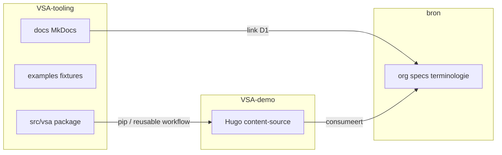

# Plan: VSA-tooling uitkleden tot tooling + docs-site

**Status:** in uitvoering  
**Branch:** `focus-on-tooling` (epic-branch; fasen als opeenvolgende commits/PR’s op deze lijn)  
**Opruimen:** dit bestand verwijderen uit `docs/plans/` wanneer alle fasen klaar zijn
(en de plannen-index bijwerken).

## Besluiten (vastgelegd)

| Onderwerp               | Keuze                                                                                         |
| ----------------------- | --------------------------------------------------------------------------------------------- |
| Docs-productie (fase 1) | `gh-pages:/docs/` → https://orthodox-groningen.github.io/VSA-tooling/docs/                    |
| Docs-preview (fase 1)   | `gh-pages:/docs-preview/` → https://orthodox-groningen.github.io/VSA-tooling/docs-preview/    |
| Branch                  | Doorwerken op `focus-on-tooling` (past bij de epic; geen parallelle docs-branch vanaf `main`) |
| TEv2 / glossary-CI      | Niet in fase 1; wel gepland als **fase 5**                                                    |
| Presentatiesite         | Blijft [VSA-demo](https://github.com/orthodox-groningen/VSA-demo)                             |

Na fase 4 (Pages-cutover): MkDocs op site-root `/` en preview `/preview/` (Hugo-demo weg;
zelfde patroon als `bron`).

## Uitgangspunt

- **VSA-tooling** = Python-package `vsa-tool`, regressiefixtures, herbruikbare GHA-workflows,
  **MkDocs Material**-docs op GitHub Pages.
- **VSA-demo** = Hugo-presentatiesite (Pages: `…/VSA-demo/`).
- **bron** = org-specs + inhoud; tool-docs linken ernaar (D1/D2), geen kopie.
- Geen big-bang delete van `examples/hugo-demo` vóór CI/docs klaar zijn.

## Doelstructuur docs (MkDocs, spiegel `bron`)

Spiegel `bron/mkdocs.yml` + `requirements-docs.txt` + deploy via
[`.github/workflows/pages-deploy-reusable.yml`](../../.github/workflows/pages-deploy-reusable.yml)
(zoals `bron`/`docs-pages.yml`). **Zonder** TEv2-pipeline tot fase 5: plain
`mkdocs build --strict`.

| Nav-sectie    | Bronmap                                                                           | Publiek                                         |
| ------------- | --------------------------------------------------------------------------------- | ----------------------------------------------- |
| Home          | `docs/index.md`                                                                   | iedereen                                        |
| Starten       | `docs/getting-started/` (nu vrijwel leeg — vullen vanuit `guides/quick-start.md`) | niet-technisch                                  |
| Handleidingen | `docs/manuals/` (geschoonde `guides/`)                                            | taken: validate, svg, musicxml, build-markdown  |
| Specificatie  | `docs/specification/`                                                             | normatief VSA-gedrag                            |
| Referentie    | `docs/reference/` + voorbeeldcatalogus                                            | lookup: grammar, outputs, **correct/incorrect** |
| Integratie    | reuse + consumer-guide                                                            | andere repo’s / CI                              |
| Plannen       | `docs/plans/`                                                                     | niet normatief                                  |

**Niet in de gepubliceerde site** (blijven in git): `docs/history/` (~200 bestanden),
`docs/architecture/`, `docs/mrgs/`. Tool-`docs/terminologie/`: stubs/links naar bron-glossary.

**Docs-opschoningslijst (fase 2):**

- Samenvoegen: `getting-started/` ← `guides/quick-start.md`; `musicxml.md` + `musicxml-export.md`;
  `testing.md` + `testing-and-regression.md`
- Eén canonieke CLI-pagina: `specification/cli.md` vs `reference/cli.md`
- Idem `traceability.md` in specification vs reference
- Hugo-guides → doorverwijzing naar VSA-demo of generieke consumer-integratie
- `user-guide.md` vs `cli-taken.md`: één taakgericht pad

**Hernoemen:** `guides/` → nav-label **Handleidingen**; map bij voorkeur `manuals/` (zoals bron).

## Wat blijft / wat weg

| Blijft                                                                | Weg of verhuist                                                                                                                                     |
| --------------------------------------------------------------------- | --------------------------------------------------------------------------------------------------------------------------------------------------- |
| `src/vsa/`, `tests/` (niet-demo), `assets/fonts/`, `pyproject.toml`   | `examples/hugo-demo/` (na migratie unieke docs)                                                                                                     |
| `examples/minimal`, `regression`, `edge-cases`, `expected-fail`       | Hugo-scripts: `build-hugo.cmd`, `serve-hugo.cmd`, `build-preview/production.cmd`, `check-hugo-*.py`, `sync_bron_zondagen` (sync hoort bij VSA-demo) |
| Herbruikbare workflows `vsa-render-reusable`, `pages-deploy-reusable` | `pages-demo.yml`, Hugo-pad in `pages-preview.yml` / `site-build.yml`                                                                                |
| Nieuw: `examples/consumer-minimal/` (1–2 md + `.vsa`) voor CI smoke   | Praktijk-/liturgie-content (al in VSA-demo)                                                                                                         |

**Repo-root detectie:** [`scripts/repo_root.py`](../../scripts/repo_root.py) markeert nu op
`examples/hugo-demo` — wijzigen naar `pyproject.toml` + `src/vsa` (hard blocker voor delete).

**Package:** `vsa-tool` heeft geen runtime-afhankelijkheid van hugo-demo.

### Inventarisatie: hugo-demo-afhankelijkheden (merge-gate)

**Workflows:** `vsa-ci.yml` (via `ci.cmd`), `site-build.yml`, `pages-preview.yml`,
`pages-demo.yml`, `release-artifacts.yml`. Ongewijzigd herbruikbaar:
`vsa-render-reusable.yml`, `pages-deploy-reusable.yml`.

**Scripts (o.a.):** `ci.cmd`, `build-hugo.cmd`, `serve-hugo.cmd`, `build-preview.cmd`,
`build-production.cmd`, `build-artifacts.cmd`, `sync_bron_zondagen.py`, `tev2_hugo.py`,
`clean-hugo-*.py`, `check-hugo-links-and-assets.py`, `check-demo-site-quality.py`,
`regenerate-missing-vsa-images.py`, `inspect-hugo-svg-usage.py`.

**Tests:** ~25 modules onder `tests/` met paden naar `examples/hugo-demo`. Fase 3 vervangt
of verwijdert die; grep op `hugo-demo` = 0 vóór fase-4-merge.

---

## Fase 1 — MkDocs-fundament

Doel: docs-site live **naast** bestaande Hugo-Pages, zonder hugo-demo te verwijderen.
Geen TEv2.

1. Toevoegen: `mkdocs.yml` (Material, NL, tabs/search zoals bron), `requirements-docs.txt`,
   optioneel `docs/overrides/` (minimaal, visueel aansluitend op bron).
2. `docs/index.md` als site-home: wat is VSA-tooling, wat niet (links naar VSA-demo + bron).
3. Workflow `docs-pages.yml` (naar voorbeeld van bron, **zonder** TEv2-stappen):
   - `main` → `destination_dir=docs`, `site_url=…/VSA-tooling/docs/`
   - andere branches → `destination_dir=docs-preview`, `site_url=…/VSA-tooling/docs-preview/`
   - deploy via `pages-deploy-reusable` met `keep_files` zodat Hugo-root en `/preview/` blijven
4. Lokaal: kort in README/AGENTS: `pip install -r requirements-docs.txt` + `mkdocs serve`.
5. Nav dekt bestaande mappen; verbergt `history/`, `architecture/`, `mrgs/`.

**Succes:** https://orthodox-groningen.github.io/VSA-tooling/docs/ bouwt op push;
pytest ongewijzigd groen.

---

## Fase 2 — Content + integratie

Doel: één leespad; unieke educatieve content uit hugo-demo `voorbeelden/` landt in MkDocs.

1. Handleidingen opschonen (duplicaten; zie lijst hierboven).
2. Migreren uit `examples/hugo-demo/content-source/voorbeelden/` naar `docs/manuals/` en
   `docs/reference/voorbeelden/` (MkDocs, geen Hugo-shortcodes als primaire UI).
3. Referentie correct/incorrect gekoppeld aan `examples/regression/`, `expected-fail/`,
   `edge-cases/` (docs citeren fixture-paden).
4. Integratie-sectie uitbreiden op [`reuse-vsa-tooling.md`](../guides/reuse-vsa-tooling.md).
5. Cross-links naar bron; stubs houden D2 aan.

**Succes:** Nav zelfstandig leesbaar zonder hugo-demo; geen org-specs gedupliceerd.

---

## Fase 3 — CI ontkoppelen van hugo-demo

Doel: CI groen zonder volle demosite.

1. Introduceer `examples/consumer-minimal/`.
2. Pas aan: `scripts/ci.cmd`, `vsa-ci.yml`, `release-artifacts.yml`; `site-build.yml` →
   `mkdocs build --strict` of laten vallen als `docs-pages` al dekt. Geen `sync-bron-zondagen`
   in VSA-tooling-CI.
3. Alle ~25 hugo-demo-tests herschrijven/verwijderen.
4. `repo_root.py` + scripts met hugo-demo als root-marker.
5. AGENTS.md / workflows-README: rol VSA-tooling vs VSA-demo.

**Succes:** CI zonder hugo-demo-content; grep `hugo-demo` in `tests/` en CI-scripts = 0
(map mag nog bestaan tot fase 4).

---

## Fase 4 — hugo-demo verwijderen + Pages-cutover

Doel: repo zonder presentatiesite; Pages = alleen MkDocs.

1. Verwijder `examples/hugo-demo/` en Hugo-only scripts.
2. Verwijder Hugo-workflows (`pages-demo`, Hugo-`pages-preview`); **docs-pages** wordt
   main → `/`, andere branches → `/preview/` (zoals bron). Maps `/docs/` en `/docs-preview/`
   opruimen of redirect-notitie op docs-home.
3. README: links naar docs-Pages + VSA-demo als voorbeeldconsumer.
4. **bron** (kleine follow-up):
   - Social/demo-URL → VSA-demo Pages
   - Inbound links bij path-moves (`guides/` → `manuals/`)
   - Eventueel zin in documentatie-eigendom: VSA-tooling Pages = tool-docs
5. Bevestig educatieve voorbeelden zitten in MkDocs (fase 2).

**Succes:** Geen `examples/hugo-demo`; repo-grep `hugo-demo` = 0.

---

## Fase 5 — TEv2 / glossary-pipeline (na MkDocs-stabiel)

Doel: terminologie-integratie vergelijkbaar met `bron`, zonder fase 1 te belasten.

1. TEv2-config + curated terms (afstemmen op bron-glossary; geen tweede norm).
2. CI-stappen: mrg-import / mrgt / hrgt / trrt (of bewust subset) vóór `mkdocs build`.
3. Eventueel gegenereerde `docs/mrgs/` en TermRefs in tool-docs.
4. Documenteren in Integratie/Handleidingen wat wel/niet in VSA-tooling vs bron hoort.

**Succes:** Docs-build met glossary-pipeline groen; D1 blijft: org-termen canoniek in bron.

---

## Buiten scope

- Inhoud/redactie van zangstukken of VSA-demo-praktijkpagina’s.
- Nieuwe VSA-syntaxfeatures.
- Volledig geautomatiseerde “alle golden SVG’s in MkDocs” (curated set + padverwijzingen volstaan;
  optionele generator later).
- Publiceren van `docs/history/` op Pages.

## Risico’s en mitigatie

| Risico                                               | Mitigatie                                                                   |
| ---------------------------------------------------- | --------------------------------------------------------------------------- |
| Broken bookmarks naar oude Hugo-Pages op VSA-tooling | Fase 1 parallel onder `/docs/`; fase 4 README + notitie op docs-home        |
| Clash Hugo `/preview/` vs docs-preview               | Docs-preview vast op `/docs-preview/` tot fase 4                            |
| CI rood door vergeten testpaden                      | Grep op `hugo-demo` als merge-gate in fase 3/4                              |
| Docs en fixtures divergeren                          | Referentiepagina’s noemen canonieke fixture-paden                           |
| `repo_root` breekt scripts                           | Marker wijzigen + pytest op root-detectie                                   |
| Epic-branch te groot voor review                     | Fasen als duidelijke commits; desnoods stacked PR’s naar `focus-on-tooling` |
