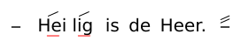

# Basis

Klein voorbeeld van VSA-invoer en SVG-rendering.

## Invoer

[Fixture](@): `examples/docs-walkthroughs/svg-phrase-kort.vsa`

```text
[:] {/Hei_}{/lig_} is de Heer. [//:]
```

## Uitleg

| Onderdeel     | Betekenis                           |
| ------------- | ----------------------------------- |
| `[:]`         | openings-pitch-marker               |
| `{/Hei_}`     | [scope](@) met [hoogte-modifier](@) |
| `is de Heer.` | gewone tekst                        |
| `[//:]`       | afsluitende [pitch-marker](@)       |

## Commando

```cmd
cd /d C:\Git\orthodox-ronl\VSA-tooling
vsa svg examples\docs-walkthroughs\svg-phrase-kort.vsa generated\docs-demo-basis.svg
```

## Verwachte output

```text
SVG geschreven naar: generated\docs-demo-basis.svg
```



Gerelateerde [fixture](@): `examples/regression/svg-basic/input.vsa`.
