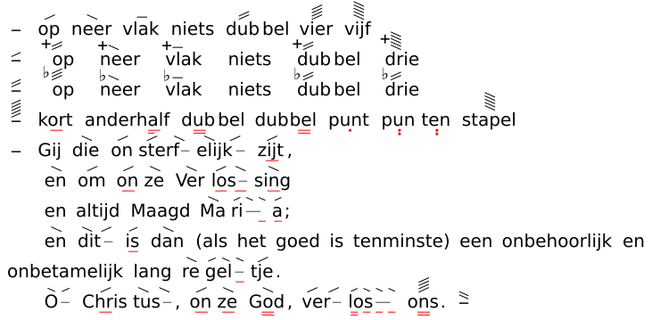
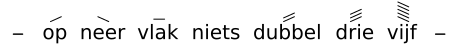
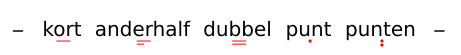

# Glyphs-overzicht

Visuele controle van veelgebruikte [VSA](@)-[glyphs](@): bron naast rendering.
Hersteld uit de oude Hugo-demo
(`voorbeelden/rendering/glyphs-basis`).

Fixture: `examples/docs-walkthroughs/svg-glyphs-overzicht.vsa`

## Overzicht (bijna alle basisglyphs)

```text
[:] {/op} {\neer} {-vlak} {~niets} {//dub}bel {////vier} {\\\\\vijf}
[/:] {+//op} {+\neer} {+-vlak} {+~niets} {#//dub}bel {♯\\\\\drie}
[//:] {b///op} {b\neer} {b-vlak} {b~niets} {♭//dub}bel {♭//drie}
[/////:] {kort_} ander{half_.} {dub__}bel dub{bel__} {punt.} {pun..}{ten..} {\\\\\stapel}
[:] Gij {\die} {/on}{/&\sterf}{\&/elijk} {/zijt_},
    {\en} {/om} {/on_}{\ze} {\Ver}{/&\los_&_}{\sing_}
    en altijd Maagd {\Ma}{/&\&\ri~&~&_}{/a_};
    {\en} {\&/dit} {/is_} {\dan} (als het goed is tenminste) een onbehoorlijk en onbetamelijk lang {\re}{/&\&\gel~&~&_}{/tje}.
    {\&/O} {/Chris_}{\&\tus}, {/on_}{\ze_} {\God__}, {/&/ver}{/&\&\&\los__&_&_&_} {////ons__}. [\\:]
```

```cmd
cd /d C:\Git\orthodox-groningen\VSA-tooling
vsa svg examples\docs-walkthroughs\svg-glyphs-overzicht.vsa generated\docs-glyphs-overzicht.svg
```



## [Hoogtemarkers](@) (compact)

Fixture: `examples/docs-walkthroughs/svg-glyphs-hoogte.vsa`

```text
[:] {/op} {\neer} {-vlak} {~niets} {//dubbel} {///drie} {\\\\\vijf} [:]
```



## Lengtemarkers (compact)

Fixture: `examples/docs-walkthroughs/svg-glyphs-lengte.vsa`

```text
[:] {kort_} {anderhalf_.} {dubbel__} {punt.} {punten..} [:]
```



## Zie ook

- [Basis](basis.md) — korte frase
- [Multiline](multiline.md) — regelafbraak
- [SVG exporteren](../../guides/svg-export.md)
- Preview-SVG’s regenereren: `python scripts\sync-docs-walkthrough-svgs.py`
