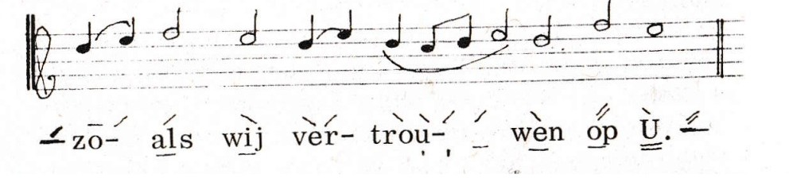
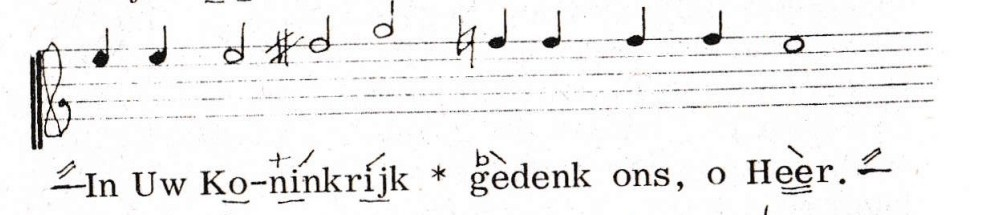

## Notatie uitleg volgens het Nederlands Liturgikon

Onderstaande tekst is overgenomen uit het Liturgikon, pp 27-30 (een uitgave van
de Nederlands Orthodoxe Kerk, dr. Kuyperstraat 2, den Haag, maart 1968).
Op een aantal plaatsen is een klein beetje tekst toegevoegd ter verduidelijking.

### De Muziek

Hoewel overal in de Orthodoxe Kerken dezelfde liturgische teksten worden gebruikt, 
is er geen algemene muziektraditie. In Griekenland en de Balkanlanden worden nog 
de oude eenstemmige melodieën gebruikt, die echter merkbaar een Turkse invloed 
hebben ondergaan.

De Russische Kerk heeft sinds een eeuw de meerstemmige muziek ingevoerd, 
volgens de Europese harmonieleer. Het gebruik van een of meer tegenstemmen 
is al veel ouder. Ook de Griekse kerkmuziek kent de *ison*, de op één toonhoogte 
aangehouden begeleidende grondtoon.

De Nederlandse Kerk, evenals de meeste Missiekerken, heeft zich aangesloten 
bij het Russische gebruik, omdat dit reeds met beperkte en weinig‑geschoolde 
krachten tot een aannemelijk resultaat voert.

Maar ook in deze melodieën is veel verscheidenheid, zodat een bepaalde keuze 
gedaan moest worden. Om voor de hand liggende redenen zijn hiervoor meestal 
de eenvoudigste voorbeelden genomen.

Zie [Kerkmuziektradities en bronnen](../kerkmuziek-tradities/) voor een overzicht 
van Slavische en andere zangtradities, waar je ze kunt beluisteren, en waar 
openbaar partituur- en scanmateriaal te vinden is.

Alle russische componisten hebben ook kerkmuziek geschreven. 
Veel daarvan draagt een concertkarakter of is slechts voor grotere koren geschikt. 
Maar onder hun werk bevinden zich ook onsterfelijk‑schone eenvoudige melodieën. 
Wie slechts ééns het vastenlied *‘Aan de stromen van Babylon…’* of op Goede Vrijdag 
*‘De rechtvaardige Josef…’* heeft horen zingen, weet dat hij deze zangen nooit meer 
vergeten zal. En eigenlijk kan hetzelfde al gezegd worden van het gewone 
*Kyrie eleison*, of het *‘Wij prijzen U…’* van elke heilige Liturgie.

De vierstemmige liturgiemuziek is apart uitgegeven. 
In deze uitgave is alleen de melodie aangegeven, in een vereenvoudigd neumenschrift.

### De Muzieknotatie

Deze kan het best duidelijk gemaakt worden aan de hand van enkele voorbeelden.

De tekens bóven de tekst geven een verandering van toonhoogte aan. 
Het aantal boven elkaar geplaatste stijgende of dalende strepen betekent een 
stijging of daling van de melodie van evenveel tonen.

Wanneer een notengroep op dezelfde toon begint als de laatstgezongen toon, 
wordt deze aangegeven met een horizontaal streepje, zoals getoond in de 
eerste lettergreep (‘zo-’) in onderstaand voorbeeld:

Om de plaats van de melodie in de toonladder vast te leggen, wordt voor het stuk 
de eerste toon aangegeven. Staat er alleen een liggend streepje, dan begint de zang 
op de grondtoon (do). Hiervoor wordt, zo mogelijk, de toon van priester of diaken 
aangehouden.

Deze ‘do’ moet dus niet verward worden met de ‘c’, die een vaste toonhoogte heeft. 
Staat een stuk met één kruis geschreven, dan is ‘g’ de grondtoon of de ‘do’, enz. 
Zo is in het tweede voorbeeld de begintoon een ‘mi’, maar die zal in werkelijkheid 
gezongen worden op ‘a’, of in die buurt. Dit moet de koorleider bepalen.

De gekozen notatie geeft dus uitsluitend de relatieve toonhoogte aan ten opzichte 
van de laatst gezongen toon, d.w.z. dat als men ergens een verkeerd interval 
genomen heeft, dan de hele rest verkeerd uitkomt; maar bij enigermate bekende 
melodieën bestaat hiervoor in de praktijk geen gevaar. Het is natuurlijk een nadeel, 
maar daar staat tegenover dat deze tekens veel vlotter geleerd worden dan noten 
lezen, en dat het gebruik mogelijk is waar muzieknotatie te kostbaar zou zijn. 
De slottoon wordt telkens aangegeven, om de overgang naar een volgend stuk te weten.

Een kruis (+) betekent een extra stijging van een halve toon; 
een mol (♭) een extra daling van een halve toon. 
Zo worden ze ook als herstellingstekens gebruikt (zie 2e voorbeeld).

Wanneer een zelfde melodietje steeds herhaald wordt, zoals bv. in de Zaligsprekingen, 
dan worden deze tekens niet steeds weer geschreven, omdat het oor zich gemakkelijk 
aanpast aan de andere toonschaal.

De tekens onder de tekst geven de duur van de tonen aan. 
Zonder teken duurt elke noot één tel, of een kwartnoot. 
Een horizontale onderstreping verdubbelt de duur tot een halve noot, twee tellen. 
Dubbele onderstreping is vier of drie tellen (zie eind van onderstaand voorbeeld, onder ‘U’).

Een punt of verticaal streepje onder de tekst maakt deze tot een achtste noot 
of halve tel (in bovenstaand voorbeeld, onder ‘trou-’, wordt dit tweemaal gebruikt).

Het einde van een muzikaal zinsdeel wordt aangegeven door een sterretje ‘*’ 
tussen de tekst, en dit zal dus vaak een rustteken zijn.

Er is geen strakke maat: het ritme moet de zinsbouw en de betekenis 
zo duidelijk mogelijk doen uitkomen.

De muziektekens zijn een uiterste vereenvoudiging van het oude Neumenschrift, 
uit de tijd dat er nog geen notenbalk was uitgevonden. 
Zij hebben het voordeel van een heel grote ruimtebesparing, 
en zijn vooral bruikbaar voor eenvoudige melodieën, 
zoals die juist in de kerkmuziek het meeste voorkomen. 
Ze kunnen ook gemakkelijk aan bestaande boeken worden toegevoegd.

    
Relatie tussen de Liturgikon-notatie en VSA

De VSA-notatie is sterk geïnspireerd door de vereenvoudigde neumennotatie zoals beschreven in het Nederlands Liturgikon (1968), maar is daar niet volledig identiek aan. VSA formaliseert en generaliseert verschillende aspecten van deze praktijknotatie om parsing, validatie, rendering en export naar formaten zoals SVG en MusicXML mogelijk te maken.

### De betekenis van `+` en `b`

De uitleg in het Liturgikon is op één punt niet eenduidig. De tekst stelt dat een kruis (`+`) *"een extra stijging van een halve toon"* betekent en een mol (`b`) *"een extra daling van een halve toon"*. Het woord "extra" laat twee interpretaties open:

1. **Versterkende interpretatie:** `+` en `b` versterken de richting van de bijbehorende beweging. Dan werkt `+` alleen zinvol bij een stijgende streep en `b` alleen bij een dalende streep — dan kunnen zuivere halve stappen niet worden genoteerd.

2. **Absolute interpretatie:** `+` verschuift het eindresultaat altijd een halve toon omhoog, `b` altijd een halve toon omlaag, ongeacht de richting van de beweging. Dan zijn alle combinaties geldig:

| Notatie | Streepjes | Modificator | Resultaat |
| :-----: | :-------: | :---------: | :-------- |
|   `+/`  |  +1 toon  |   +½ toon   | +1½ toon omhoog |
|   `b\`  |  −1 toon  |   −½ toon   | −1½ toon omlaag |
|   `b/`  |  +1 toon  |   −½ toon   | **+½ toon omhoog** |
|   `+\`  |  −1 toon  |   +½ toon   | **−½ toon omlaag** |

Het gebruik in het Liturgikon zelf wijst op de **absolute interpretatie**: de combinatie `+\` (dalende streep met kruis) komt voor als notatie voor een halve stap omlaag (zie bijv. het zaterdagse prokimen (p 180), het prokimen op p 181, en het prijslied op p. 188.), en niet als 1½ toon omlaag. Op grond hiervan is de absolute interpretatie vrijwel zeker de bedoelde: `+` en `b` zijn daarmee absolute modificatoren die het eindresultaat van de beweging een halve toon opschuiven, los van de bewegingsrichting.

In Liturgikon lijkt zich met `+` en `b` niet altijd aan haar eigen beschrijving te houden. Als voorbeeld geldt het prokimen van de woensdagen (Liturgikon, p247), dat er als volgt uitziet (op de hoogte-markering op het eind na):

::: vsa-notatie
[//:] Mijn ziel ver{/heft_} {den_} {\Heer_},
en ge{/juicht_} {\heeft} mijn {\geest_} {-&/in} {/&\God}, {\&/mijn} {\&+\Red_&_}{/der_}.
:::

Als dit gezongen zou worden conform de notatie beschrijving, dan zou de eindmarkering `[b/:]` moeten zijn,
en niet `[/:]` zoals in het Liturgikon. Echter, in de praktijk wordt `{/der_}` gezongen als `{b/der_}`, 
zodat het toch op `[/:]` uitkomt. Kennelijk moeten we `+\` dan lezen als dat er een kruis voor de volgende
noot gedacht moet worden, want als je dan weer een stap omhoog gaat kom je weer op dezelfde toonhoogte uit
als die van de noot voor die kruis. Maar dan is de betekenis van stappen als `/` plotseling ambigu geworden.

### Implementatie in VSA

VSA volgt de absolute interpretatie. Het systeem gebruikt een halftoon-prefix die altijd vóór een basisbeweging staat:

| VSA-notatie | Alias(es) | Basisbeweging | Netto beweging |
| :---------: | :-------: | :-----------: | :------------- |
| `#/`        | `+/`, `♯/` | +1 trede      | +1½ toon omhoog |
| `b/`        | `♭/`       | +1 trede      | +½ toon omhoog |
| `#\`        | `+\`, `♯\` | −1 trede      | −½ toon omlaag |
| `b\`        | `♭\`       | −1 trede      | −1½ toon omlaag |
| `#-`        | `+-`, `♯-` | 0 (unisono)   | +½ toon (chromatisch) |
| `b-`        | `♭-`       | 0 (unisono)   | −½ toon (chromatisch) |

De canonieke symbolen in VSA zijn `#` (kruis) en `b` (mol). De aanduidingen `+` en `♯` zijn toegestane aliassen voor `#`; `♭` is een alias voor `b`. In de documentatie en in nieuwe notaties wordt `#` en `b` aanbevolen; bestaande notaties met `+` en `♭` zijn en blijven geldig.

Een standalone `#` of `b` — zonder basisbeweging — is niet toegestaan. Een kruis of mol bij een toon zonder expliciete richtingsstreep wordt genoteerd als `#-` (chromatisch omhoog) of `b-` (chromatisch omlaag).

### Verschil met VSA

| Onderwerp     | Liturgikon-notatie                          | VSA |
| ------------- | ------------------------------------------- | --- |
| Doel          | Praktische zanghulp voor menselijke zangers | Formele, machine-verwerkbare notatie |
| Syntax        | Geen formele grammatica                     | Volledig formele syntax (EBNF) |
| Structuur     | Markeringen direct boven/onder tekst        | Gestructureerde scopes `{...}` |
| Toonhoogte    | Relatieve intervalnotatie                   | Relatieve toonladder-notatie binnen een do-context |
| Kruis en mol  | `+` en `♭` als prefix op richtingspijl      | `#` en `b` als canonieke prefix; `+`, `♯`, `♭` als aliases |
| Lege posities | Impliciet                                   | Expliciet via `~` |
| Melisma       | Impliciet / ad hoc                          | Formeel model via samengestelde modifiers |
| Validatie     | Alleen muzikaal gehoor                      | Syntactische en semantische validatie |
| Export        | Niet voorzien (kopieerapparaat of scanner)  | SVG en MusicXML |

